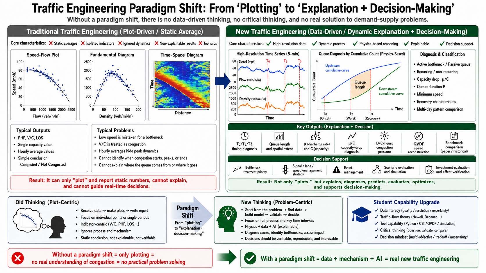

# CBI+ — Congestion Bottleneck Identification / FD / QVDF calibration pipeline

**In plain words: this tool diagnoses WHY a freeway is congested — which
bottleneck causes it, when it starts, how long it lasts — instead of just
plotting that it is.** (AMS = Analysis, Modeling & Simulation of traffic.)

*Agentic AI for Translational AMS Modeling — first working instance.
Scheme-driven · engine-agnostic · quality-gated.*

**New here?** Two five-minute reads before anything else:
[docs/GLOSSARY.md](docs/GLOSSARY.md) (every symbol, plain English) and
[docs/SETUP_FOR_BEGINNERS.md](docs/SETUP_FOR_BEGINNERS.md) (where to type
the commands, how to open a notebook).



**The paradigm in one frame** — left: plot-driven traffic engineering (PHF, V/C,
hourly averages — reports numbers, cannot explain or decide). Right:
mechanism-based diagnosis (5-minute dynamics, cumulative-curve queue physics
T0/T2/T3, μ/C capacity drop, QVDF reconstruction, benchmark gates) feeding
real decisions. **Every element on the right is runnable in this repository.**

**What this repo has already proven** (all regenerate with one command; the
gates are internal reproduction checks, not external peer review):

| 25/25 | 5 | 12 | 7 | 2 | 5 |
|:-:|:-:|:-:|:-:|:-:|:-:|
| reproduction gates PASS | published-work reproductions (Tables 5/6/7 exact) | engines, one contract | corridors diagnosed | arenas where engines compete | executed teaching notebooks |

**Front doors:** 🌐 [website front page](index.html) ·
📓 [teaching notebooks](notebooks/README.md) (start with
[01 — no data needed](notebooks/01_getting_started.ipynb)) ·
🔬 [benchmark reproductions](benchmarks/index.html) ·
📦 [pip package guide](docs/PACKAGE_GUIDE.md) ·
📖 [the Introduction](docs/INTRODUCTION.md)

A general-purpose, per-corridor calibration toolkit for the four-layer
traffic-engineering pipeline:

**C**ongestion **B**ottleneck **I**dentification → **F**undamental **D**iagram →
discharge-rate **μ** validation → **QVDF** (Queue Volume-Delay Function) forward model

> **This tool is not about learning how to run another traffic software
> package. It is about learning how to think like a modern traffic engineer:
> observe, diagnose, explain, validate, and decide.**

```python
# Type these in a terminal: Command Prompt on Windows, Terminal on Mac.
# Never used one? -> docs/SETUP_FOR_BEGINNERS.md
pip install cbi-plus            # (or `pip install -e .` from this repo folder)

from cbi_pipeline import api
df = api.simulate_corridor(days=5)   # no data files needed — planted AM bottleneck
out = api.diagnose(df)               # QC -> episodes -> FD -> QVDF -> CBI ranking
out["ranking"].head()                # who deserves the money, and why
```

**Start here: [docs/INTRODUCTION.md](docs/INTRODUCTION.md)** — who we train, what the
old teaching misses, the LWR–Newell–Daganzo foundation, and the mission.

Why this platform exists: **[docs/MISSION.md](docs/MISSION.md)** (the medical-school analogy and the seven operating principles) · theory foundations: **[docs/teaching/THEORY_FOUNDATIONS.md](docs/teaching/THEORY_FOUNDATIONS.md)** (why V/C is not congestion; LWR-Newell-Daganzo). New here? Read **[docs/GLOSSARY.md](docs/GLOSSARY.md)** first (5 minutes - every symbol, and the paper-to-pipeline name map).

Given a corridor of detectors (speed + optional volume, 5-minute cadence), CBI+
answers, per detector × day × period (AM / MD / PM):

| Question | Output |
|---|---|
| *When did congestion start / peak / clear?* | queue object **T0, T2, T3** + duration **P** |
| *How bad?* | lowest speed **v_t2**, regime ∈ {uncongested, mild, recurring, severe, event} |
| *What does the bottleneck actually serve?* | discharge rate **μ** = median flow while the queue drains |
| *How much capacity was lost?* | **μ/C** — the capacity drop (typically 0.85–0.95) |
| *Can two numbers reproduce the day?* | QVDF elasticities (Q_n, Q_s, Q_cd, Q_cp) + closed-form v(t) |
| *Is any of this trustworthy?* | quality gates + per-episode audit panels (PNG) |

Handles both **PeMS** (speed + measured volume → real S3 FD fit) and **INRIX TMC**
(speed-only → volume synthesized via the CBI inverse-S3 prior).

## Install / run

```bash
pip install -e .        # installs cbi_pipeline + all dependencies (incl. scipy)

# Your first 30 minutes (every step runs on IN-REPO data):
python -m cbi_pipeline.repro_gates                 # 0. is my clone healthy? (~5 s)
# 1. read docs/GLOSSARY.md (5 min) then docs/STAGE_CHAIN.md (the one-page map)
# 2. the hello world (reproduces the QVDF paper exactly, ~2 min, in-repo data):
#      cd benchmarks/qvdf_paper_i10 && python reproduce_qvdf_paper.py
# 3. full pipeline on in-repo I-10:  python teaching_cases/case_02_ca_pems_i10.py

# CA PeMS corridor (measured volume)
python -m cbi_pipeline.corridor_workflow --corridor 10-E --source pems --pems-path benchmarks/I-10/link_performance.json

# AZ INRIX TMC corridor (speed-only, CBI inverse-S3 synthesis)
python -m cbi_pipeline.corridor_workflow \
    --corridor I-17 --source inrix \
    --inrix-folder additional/benchmark_datasets/datasets/I-17 \
    --s3-prior az_tmc_i17 --rederive-kc-and-m
```

Outputs per corridor: `stage1_qc/ … stage5b_corridor/`, FIXED-layout `figures/`,
per-episode verification `panels/`, and `quality_gates.json` (PASS/FAIL).

## TrafficFlowBench (IEEE competition) bridge

`tfb_adapter.py` runs the full pipeline directly on the **TrafficFlowBench**
PeMS-LA release (parquet detector states + GMNS network):

```bash
# REQUIRES the external TrafficFlowBench release (not in this repo):
#   set TFB_DATA_ROOT=<path to 02_data_PeMS_LA> - nothing else here needs it
python tfb_adapter.py I-210E 2026-06-01 2026-06-28
python tfb_teaching_extract.py     # emit the CBI-Lab teaching payload (data.json)
```

The adapter derives effective lanes from the data (never trust map lane tags),
respects the release's `is_observed` imputation mask, and feeds the standard
pipeline. The extracted payload drives the **CBI Lab** interactive teaching page
(gui4gmns → TrafficFlowBench → CBI Lab): raw space-time field → identified queue
objects → physical queue under the microscope → corridor law.

Start with **[docs/TFB_CBI_GUIDE.md](docs/TFB_CBI_GUIDE.md)** — how to run, what
to read in which order, healthy magnitudes, per-period interpretation, pitfalls.

## The five stages

| Stage | Module | Produces | Outlier mitigation |
|---|---|---|---|
| 1 QC | `stage1_qc` | `qc_pass`, cleaned speed | Hampel MAD, jump, spatial-neighbor, per-day multi-bottleneck wave-direction check |
| 2 Episodes | `stage2_episodes` | queue objects per (sensor, day, period) + MD→PM boundary merge | per-(sensor, period) z-score event flag; NaN-gap + persistence hardened scan |
| 2b Screen | `stage2b_measured_diagnostics` | physical-violation flags on measured D/C, μ, V_t2 | Huber residuals |
| 3 FD | `stage3_fd_robust` | per-sensor S3 fit (capacity, v_c) + bootstrap CI | Huber loss, regime-separated |
| 4 μ | `stage4_mu_validation` + `stage4_verification` | μ per episode/link + step-by-step audit CSV/panels | discharge-window median, group shrinkage |
| 5 QVDF | `stage5_qvdf` + `stage5_verification` + `stage5b_corridor_aggregate` | elasticities per (sensor, period) + exact round-trip audit + corridor law with bootstrap CI & prior shrinkage | IQR, feasibility ranges (C++ verbatim) |

## Closeout: benchmarks, gates, and the CBI ranking

CBI+ is accepted only against evidence — see **[docs/CLOSEOUT.md](docs/CLOSEOUT.md)**:

- **Stage 6 (CBI deliverable):** every run emits
  `stage6_cbi/benchmark_bottleneck_ranking.csv` — sensor-period bottleneck
  scores (frequency × duration × severity) with active / passive / spillback
  classes and explicit aggregation-level labels.
- **Hard gates:** `python -m cbi_pipeline.benchmark_gates <run_dir>` writes
  `pass_fail_summary.csv` + `benchmark_comparison_report.csv` (physics bands,
  episode sufficiency, QVDF round-trip ≤ 10 mph MAE, ranking stability vs a
  reference run). Thresholds: `benchmarks/benchmark_validation_tolerance_template.csv`.
- **Benchmark cases in-repo:** `benchmarks/I-10` and `benchmarks/I-405`
  (public Caltrans PeMS, March 2018, with their own sensor tables +
  `MANIFEST.json`) reproduce with one command each; I-395 NVTA runs from the
  private data path.
- **Dataset discovery:** `python -m cbi_pipeline.discover <root>` inventories
  every CBI-compatible dataset under a directory tree with readiness verdicts.

## Provenance & audits

Ten issues were found and fixed during the 2026-07 TrafficFlowBench integration
(period-relative indexing, D/C units, imputed-data ingestion, single-bottleneck
direction gate, …) — every one documented with evidence and root cause in
**[docs/FIXES_CBI_PLUS_2026-07-07.md](docs/FIXES_CBI_PLUS_2026-07-07.md)**. Read
it before comparing against pre-fix outputs. The design lesson running through
all ten: *physics quantities get exactly one implementation, indices carry their
frame with them, and priors (maps, imputation) are never treated as measurements.*

## Teaching cases

Four self-contained scripts under `teaching_cases/` (AZ I-17 INRIX week,
CA I-10E and I-405S PeMS months, and a cross-corridor comparison). See
`teaching_cases/README.md`.

## Lineage

Successor to `clean_handoff_v1/v2` (Abbasi & Zhou, ASU) and the original CBI
tool; QVDF forms mirror the DTALite C++ `scan_congestion_duration` /
`calculate_travel_time_based_on_QVDF` flow verbatim, including feasibility
ranges. Companion visual layer: [gui4gmns](https://github.com/asu-trans-ai-lab/gui4gmns).

## License, citation, scope

MIT — see [LICENSE](LICENSE). Cite via [CITATION.cff](CITATION.cff) (the
QVDF methods paper: Zhou et al. 2022, *Multimodal Transportation*
1:100017). Maintained by the ASU Trans+AI Lab. Current scope: US freeway
corridors (PeMS / INRIX / IEEE TrafficFlowBench data); units are US
customary (mph, veh/mi) with conversions stated at every loader — apply
judgment before generalizing elsewhere. Issue history and enhancement
backlog: [docs/ISSUE_REGISTER.md](docs/ISSUE_REGISTER.md).
